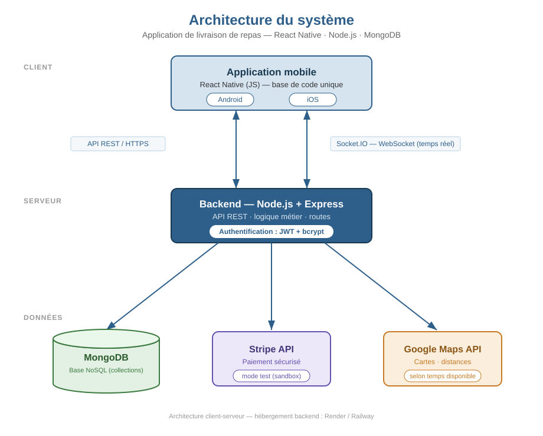
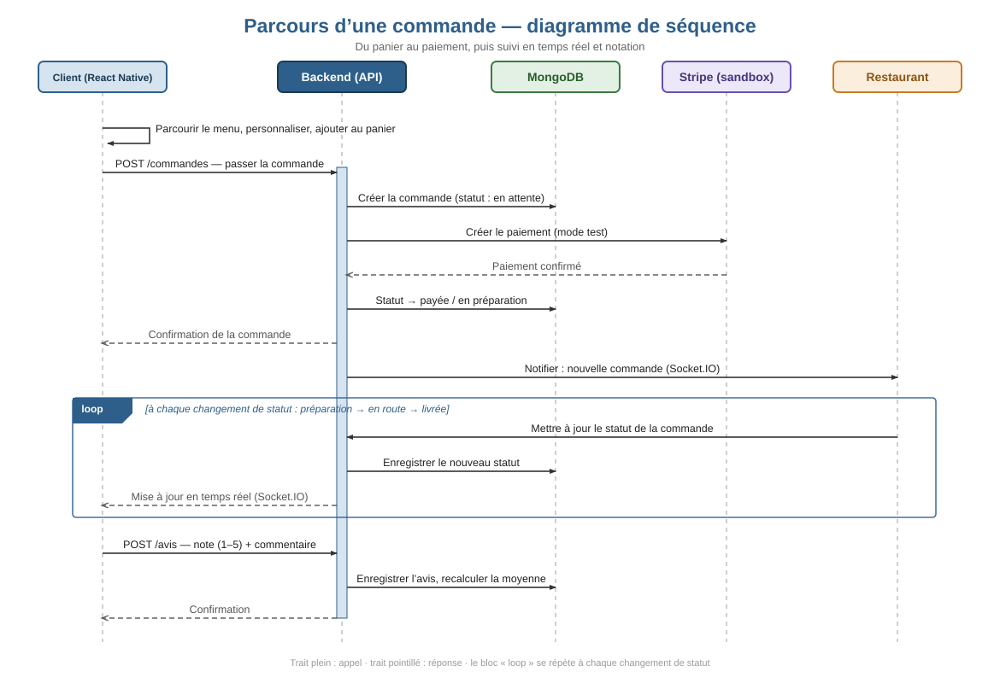

# Architecture du système

> État au 2 août 2026 — version 3.1 de l'API. Ce document décrit ce qui est
> **réellement implémenté**, pas ce qui était prévu au cadrage.

## Vue d'ensemble

Savora suit une architecture **client-serveur**. Une application mobile Expo /
React Native communique avec un backend Node.js/Express par une **API REST**
pour les opérations classiques, et par un **canal Socket.IO** pour tout ce qui
doit apparaître sans rafraîchissement : nouvelles commandes, changements de
statut, messages de discussion.



*Figure 1 — Architecture client-serveur de l'application.*

## Composants réels

| Composant | Technologie | Rôle |
|-----------|-------------|------|
| Application mobile | Expo SDK 54, React Native 0.81, **TypeScript**, expo-router | Interface des quatre rôles (Android, iOS, web) |
| Serveur / API | Node.js 20+, Express 4 | Logique métier, routes REST, contrôle d'accès |
| Base de données | MongoDB 6+ via Mongoose 8 | Persistance |
| Temps réel | Socket.IO 4 | Suivi de commande et discussion |
| Paiement | Stripe (mode test) **ou** simulation locale | Encaissement de la commande |
| Cartographie | react-native-maps + expo-location | Trajet du livreur |
| Authentification | JWT (24 h) + bcrypt (12 tours) | Sessions et mots de passe |
| Session mobile | expo-secure-store | Conservation du jeton entre deux lancements |
| Notifications | expo-notifications + service Expo Push | Alerte à chaque étape de la commande |
| Hébergement | Render ou Railway + MongoDB Atlas | Déploiement du backend |

> **Écart assumé par rapport au cadrage.** Le cahier des charges v2 prévoyait
> React Native en JavaScript avec Redux ou Context API, et Google Maps API.
> Le projet utilise TypeScript (voir [ADR 0003](./decisions/0003-typescript-et-expo-router.md)),
> Context API seul (le volume d'état ne justifiait pas Redux) et
> react-native-maps sans clé Google Maps, l'écran de carte se contentant du
> fournisseur natif de la plateforme.

## Découpage du backend

```
backend/src/
├── index.js              point d'entrée : middlewares, routes, démarrage
├── config/
│   ├── environnement.js  lecture et validation des variables .env
│   ├── db.js             connexion Mongoose
│   └── socket.js         authentification et salons Socket.IO
├── middleware/
│   ├── auth.js           vérification du jeton + rechargement de l'utilisateur
│   ├── roles.js          autorisation par rôle
│   ├── securite.js       en-têtes HTTP, limitation de débit, politique CORS
│   └── erreurs.js        404 et gestionnaire d'erreurs unique
├── services/             règles métier pures, testables sans base de données
│   ├── tarification.js   prix des lignes, taxes, total
│   ├── statutsCommande.js machine à états et droits par rôle
│   ├── validationMenu.js règles de saisie des restaurants et des plats
│   ├── paiement.js       Stripe en mode test, ou simulation
│   └── notifications.js  composition et envoi des notifications poussées
├── models/               schémas Mongoose
├── controllers/          orchestration HTTP
├── routes/               déclaration des points d'entrée
├── utils/                enveloppe asynchrone, échappement de regex
└── scripts/              seed et création de comptes
```

Le découpage **services / controllers** a été introduit pour que les règles
métier (calcul du total, transitions de statut) soient testables unitairement
et n'existent qu'à un seul endroit.

## Flux d'une commande



*Figure 3 — Du panier au paiement, puis suivi en temps réel et notation.*

1. Le client compose son panier, choisit ses options de personnalisation et
   valide (`POST /api/commandes`).
2. Le serveur **relit les prix en base** — il ne fait jamais confiance aux
   montants envoyés par le client —, calcule sous-total, taxes et total.
3. Le paiement est traité **avant** l'enregistrement : la commande n'existe en
   base que si le paiement a réussi, ou s'il est différé à la livraison.
4. La commande est diffusée par Socket.IO au restaurant concerné et aux
   administrateurs (`commande:nouvelle`).
5. Le restaurant fait évoluer le statut : `confirmée → en préparation → prête`.
   Chaque transition est validée par la machine à états.
6. Au statut `prête`, la commande apparaît chez tous les livreurs
   (`commande:disponible`). Le premier qui accepte l'obtient : l'attribution
   utilise un `findOneAndUpdate` **atomique**, ce qui empêche deux livreurs de
   prendre la même course.
7. Le livreur passe `en route` puis `livrée`. Le client voit chaque étape sans
   rafraîchir (`commande:mise-a-jour`).
8. Une fois livrée, le client peut noter le restaurant
   (`POST /api/commandes/:id/avis`). La note moyenne est recalculée par
   agrégation MongoDB.

## Attribution des livraisons

L'attribution est **volontaire, pas automatique** : aucun algorithme n'affecte
un livreur à une commande. C'est un modèle *pull* — le livreur choisit.

### Quand la course est proposée

Une commande n'est **jamais** proposée aux livreurs au moment où elle est
passée. Elle ne le devient qu'au statut `prête`, posé par le restaurant :
inutile d'envoyer quelqu'un chercher un repas qui n'est pas prêt.

```
Client paie
  └─► en attente                    les livreurs ne voient rien
Restaurant : confirmée
             en préparation
             prête ─────────────►   « commande:disponible »
                                    diffusé à TOUS les livreurs connectés
Premier livreur qui accepte ────►   « commande:attribuee »
                                    la course disparaît des autres écrans
```

### Comment deux livreurs simultanés sont départagés

```js
Commande.findOneAndUpdate(
  { _id: id, statut: "prête", livreurId: null },   // le filtre est la garantie
  { $set: { livreurId: moi, statut: "prise en charge" } }
);
```

MongoDB garantit qu'une modification de document est atomique. Le premier
livreur passe. Le second arrive quelques millisecondes plus tard : `livreurId`
n'est plus `null`, **le filtre ne correspond plus**, `findOneAndUpdate` renvoie
`null`, et le contrôleur répond **409**.

Il n'y a ni verrou, ni transaction, et c'est précisément ce qui rend la chose
correcte. Un `findById` suivi d'un `save()` aurait laissé une fenêtre où les
deux livreurs lisent `livreurId: null` puis s'écrasent mutuellement.

### Limites assumées de ce modèle

Ce sont des choix de périmètre, pas des oublis :

| Limite | Conséquence | Piste |
|--------|-------------|-------|
| Aucune notion de **proximité** | Un livreur à l'autre bout de la ville voit la même course que celui devant le restaurant | Filtrer par distance à partir de la position du livreur |
| Aucune **réattribution** | Si personne n'accepte, la commande reste `prête` indéfiniment — pas de file d'attente, pas de relance | Délai d'expiration puis escalade |
| Un livreur ne peut pas **se désister** | Seul un administrateur peut annuler la commande | Route de désistement remettant `livreurId` à `null` |

## Temps réel : organisation des salons

À la connexion, le socket est authentifié par le même jeton JWT que l'API,
puis rejoint automatiquement plusieurs salons :

| Salon | Qui le rejoint | Ce qu'il reçoit |
|-------|----------------|-----------------|
| `utilisateur:<id>` | tout compte connecté | ses propres commandes |
| `role:livreur` | les livreurs | les commandes disponibles |
| `role:admin` | les administrateurs | toute l'activité |
| `restaurant:<id>` | les comptes restaurant | les commandes de leur établissement |
| `commande:<id>` | à la demande | messages de la discussion |

Un socket sans jeton valide est refusé à la poignée de main : le canal temps
réel n'est pas une porte dérobée qui contournerait l'API.

## Gestion du catalogue

Le catalogue n'est plus figé dans un script de démarrage. Deux rôles peuvent
le faire évoluer, via un contrôleur unique (`menuController.js`) :

| Rôle | Portée | Routes |
|------|--------|--------|
| Administrateur | N'importe quel établissement | `/api/admin/restaurants`, `/api/admin/plats` |
| Gestionnaire de restaurant | Uniquement le sien | `/api/mon-restaurant` |

Le cloisonnement ne repose **pas** sur la route appelée mais sur la fonction
`resoudreRestaurant()`, qui vérifie systématiquement le droit d'accès. Un
gestionnaire qui viserait un autre établissement par l'URL reçoit un 403
explicite plutôt qu'une redirection silencieuse.

Deux règles méritent d'être signalées :

- **La note n'est jamais acceptée en écriture.** Elle est calculée à partir
  des avis réels. L'accepter dans un formulaire permettrait de la truquer.
- **Retirer un plat ne le supprime pas.** Il devient indisponible et quitte le
  menu client. Des commandes passées le référencent : l'effacer casserait
  l'historique. Seule l'administration peut forcer une suppression définitive
  (`?definitive=true`).

Le script `npm run seed` est désormais **non destructif** : il crée ce qui
manque et met à jour ce qui existe, en identifiant les enregistrements par
leur nom. Les restaurants créés depuis l'application survivent donc à un
rechargement du jeu de démonstration. `npm run seed:reinitialiser` reste
disponible pour repartir d'une base propre.

## Notifications

Deux canaux complémentaires, pour la même raison que le double mode de
paiement : la démonstration doit fonctionner dans Expo Go.

| Canal | Mécanisme | Portée | Limite |
|-------|-----------|--------|--------|
| Push distantes | Service Expo Push, appelé par le serveur | Atteint l'appareil même application fermée | Ne fonctionne plus dans Expo Go sur Android depuis le SDK 53 : nécessite un *development build* |
| Notification locale | L'application l'affiche à la réception d'un événement Socket.IO | Fonctionne partout, y compris Expo Go | Uniquement application ouverte |

Le serveur envoie toujours le premier canal s'il connaît un jeton d'appareil,
et émet toujours l'événement Socket.IO. Les deux ne font pas doublon :
Expo Go ne reçoit jamais les push distantes, et un *development build* qui les
reçoit n'a l'application au premier plan que dans un cas sur deux.

Trois précautions de conception :

- Les erreurs d'envoi sont **absorbées et journalisées**. Une notification
  perdue est moins grave qu'un changement de statut qui échoue à cause d'elle.
- Les jetons signalés `DeviceNotRegistered` par Expo sont supprimés
  automatiquement, pour ne pas conserver d'appareils désinstallés.
- Le jeton est retiré à la déconnexion : un téléphone partagé ne reçoit pas
  les commandes du compte précédent.

## Sécurité

- Mots de passe hachés avec bcrypt (12 tours), jamais renvoyés par l'API
  (`select: false` sur le champ).
- Jeton JWT de 24 h. Le middleware **recharge l'utilisateur en base** à chaque
  requête : un compte supprimé ou rétrogradé perd ses droits immédiatement, sans
  attendre l'expiration du jeton.
- Le rôle ne peut pas être choisi à l'inscription ni modifié via `PUT /auth/profil`.
- Limitation de débit sur `/auth/connexion` (10 tentatives par 15 minutes) et
  garde-fou global à 300 requêtes par minute.
- En-têtes de sécurité HTTP et politique CORS par liste blanche en production.
- Les saisies de recherche sont échappées avant d'entrer dans un `$regex`
  (protection contre le ReDoS).
- Aucun numéro de carte n'est stocké : seule la référence de transaction l'est.

Détail des choix : [ADR 0004](./decisions/0004-paiement-stripe-ou-simulation.md).

## Limites connues

- Pas d'envoi de courriel : le jeton de réinitialisation de mot de passe est
  renvoyé dans la réponse HTTP **en développement uniquement**.
- La position du livreur sur la carte utilise la position du téléphone du
  livreur ; les positions du restaurant et du client sont encore fixes.
- La limitation de débit est en mémoire de processus : elle ne se partage pas
  entre plusieurs instances du serveur.
- L'attribution des livraisons ignore la proximité, ne se réattribue pas et
  n'autorise pas le désistement (voir « Attribution des livraisons »).
- Aucun test d'intégration automatisé sur les routes ; les tests couvrent les
  services métier et les utilitaires de sécurité.
- Les notifications distantes exigent un *development build* : elles ne sont
  pas démontrables dans Expo Go sur Android.
- Sur l'offre gratuite de Render, l'instance s'endort après inactivité et met
  environ 50 secondes à répondre à la première requête.
- L'écran de carte utilise **deux implémentations selon la plateforme** :
  react-native-maps sur mobile, Leaflet et OpenStreetMap sur le web.

  La séparation a demandé deux précautions, dans cet ordre :

  1. **Pas d'import conditionnel.** Metro analyse les `require()` à la
     compilation ; une condition d'exécution arrive trop tard, le module natif
     entre quand même dans le paquet.
  2. **Les deux implémentations vivent hors du dossier des routes**, dans
     `src/components/`. Expo Router construit ses routes avec `require.context`,
     qui énumère *tous* les fichiers de `src/app` — les deux variantes de
     plateforme y entraient donc, et l'extension `.web.tsx` ne suffisait pas.
     La route se contente de réexporter le composant ; cet import normal est,
     lui, résolu par plateforme.
- La carte web dépend d'un CDN (unpkg) pour Leaflet et d'OpenStreetMap pour
  les fonds de carte. Sans réseau, elle affiche un message de repli. La
  version mobile suit la position réelle du livreur en continu, ce que la
  version web ne fait pas.
