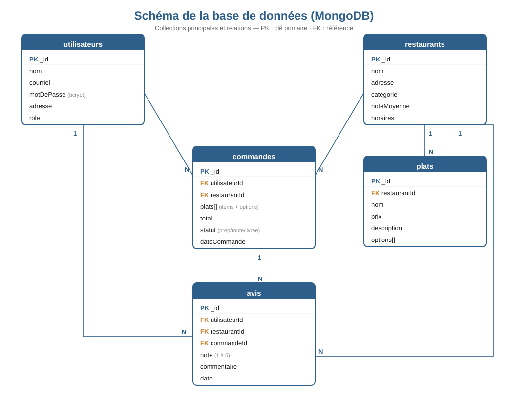

# Base de données (MongoDB)

> État au 2 août 2026. Ce document décrit les schémas Mongoose réellement
> définis dans `backend/src/models/`.



*Figure 2 — Collections MongoDB et relations.*

Six collections : `utilisateurs`, `restaurants`, `plats`, `commandes`,
`messages`, `avis`. Toutes portent `createdAt` et `updatedAt`
(option `timestamps` de Mongoose).

---

## `utilisateurs`

| Champ | Type | Notes |
|-------|------|-------|
| `_id` | ObjectId | clé primaire |
| `nom` | String | 2 caractères minimum |
| `courriel` | String | **unique**, en minuscules |
| `motDePasse` | String | haché bcrypt, `select: false` |
| `telephone` | String | facultatif |
| `adresses` | Array\<{libelle, adresse, ville, codePostal}\> | sous-documents |
| `role` | String | `client` \| `restaurant` \| `livreur` \| `admin` — indexé |
| `restaurantId` | ObjectId → `restaurants` | uniquement pour le rôle `restaurant` |
| `jetonReinitialisation` | String | empreinte SHA-256, `select: false` |
| `expirationJetonReinitialisation` | Date | `select: false` |

Seule l'**empreinte** du jeton de réinitialisation est stockée : une fuite de
la base ne permettrait pas de réutiliser un jeton en attente.

---

## `restaurants`

| Champ | Type | Notes |
|-------|------|-------|
| `_id` | ObjectId | |
| `nom` | String | indexé |
| `cuisine` | String | |
| `description` | String | |
| `image` | String | URL |
| `adresse` | String | |
| `note` | Number 0–5 | **calculée** à partir de `avis`, jamais saisie |
| `nombreAvis` | Number | recalculé avec `note` |
| `delai` | String | ex. « 25–35 min » |
| `fraisLivraison` | Number | |
| `actif` | Boolean | indexé — un restaurant désactivé disparaît du catalogue |

---

## `plats`

| Champ | Type | Notes |
|-------|------|-------|
| `_id` | ObjectId | |
| `restaurantId` | ObjectId → `restaurants` | indexé |
| `nom`, `description`, `categorie`, `image` | String | |
| `prix` | Number | prix de base |
| `options` | Array\<{nom, prix}\> | suppléments de personnalisation |
| `populaire` | Boolean | mis en avant dans le menu |
| `disponible` | Boolean | un plat indisponible est refusé à la commande |

---

## `commandes`

| Champ | Type | Notes |
|-------|------|-------|
| `_id` | ObjectId | |
| `utilisateurId` | ObjectId → `utilisateurs` | le client |
| `restaurantId` | ObjectId → `restaurants` | |
| `livreurId` | ObjectId → `utilisateurs` \| null | attribué au statut « prise en charge » |
| `plats` | Array de sous-documents | `{platId, nom, prix, quantite, options[]}` |
| `sousTotal`, `fraisLivraison`, `taxes`, `total` | Number | calculés côté serveur |
| `statut` | String | 8 valeurs, voir ci-dessous — indexé |
| `historiqueStatuts` | Array\<{statut, date, modifiePar}\> | traçabilité complète |
| `adresseLivraison` | String | |
| `methodePaiement` | String | `carte` \| `livraison` |
| `fournisseurPaiement` | String | `stripe` \| `simulation` \| `comptant` |
| `statutPaiement` | String | `en attente` \| `payé` \| `à payer` \| `échoué` \| `remboursé` |
| `referencePaiement` | String | identifiant Stripe ou référence simulée |
| `datePaiement` | Date | |
| `avisDepose` | Boolean | évite une requête pour savoir s'il faut proposer la notation |

**Le nom et le prix des plats sont recopiés dans la commande.** Si le
restaurant modifie ensuite son menu, la commande conserve ce qui a été
réellement payé — une commande est une pièce comptable, pas une vue sur le menu.

### Index

- `{ utilisateurId: 1, createdAt: -1 }` — historique d'un client
- `{ restaurantId: 1, createdAt: -1 }` — tableau de bord restaurant
- `{ statut: 1, livreurId: 1 }` — livraisons disponibles

### Machine à états

```
en attente ──► confirmée ──► en préparation ──► prête
     │             │               │              │
     ▼             ▼               ▼              ▼
  annulée       annulée         annulée    prise en charge ──► en route ──► livrée
```

Une commande ne peut plus être annulée une fois qu'elle est `prête` : le repas
est déjà préparé. `livrée` et `annulée` sont des états terminaux.

---

## `messages`

| Champ | Type | Notes |
|-------|------|-------|
| `_id` | ObjectId | |
| `commandeId` | ObjectId → `commandes` | indexé |
| `auteurId` | ObjectId → `utilisateurs` | |
| `texte` | String | 1000 caractères maximum |

Y ont accès : le client de la commande, le restaurant concerné, le livreur
assigné et les administrateurs.

---

## `avis`

| Champ | Type | Notes |
|-------|------|-------|
| `_id` | ObjectId | |
| `commandeId` | ObjectId → `commandes` | **index unique** |
| `restaurantId` | ObjectId → `restaurants` | indexé |
| `utilisateurId` | ObjectId → `utilisateurs` | indexé |
| `note` | Number 1–5 | entier |
| `commentaire` | String | 600 caractères maximum, facultatif |

L'**index unique sur `commandeId`** garantit qu'une commande livrée ne peut
être notée qu'une seule fois. La contrainte est portée par la base, pas
seulement par le contrôleur : deux requêtes simultanées ne peuvent pas créer
deux avis.

Après chaque avis, la note du restaurant est recalculée par agrégation :

```js
Avis.aggregate([
  { $match: { restaurantId } },
  { $group: { _id: "$restaurantId", moyenne: { $avg: "$note" }, nombre: { $sum: 1 } } },
]);
```

La moyenne est ainsi toujours calculée sur l'ensemble réel des avis, même si
plusieurs clients notent au même moment.
